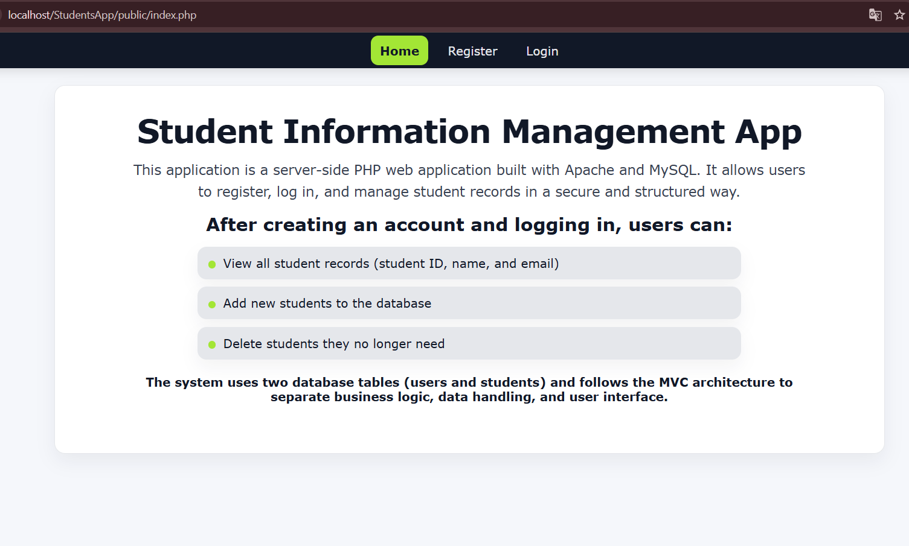
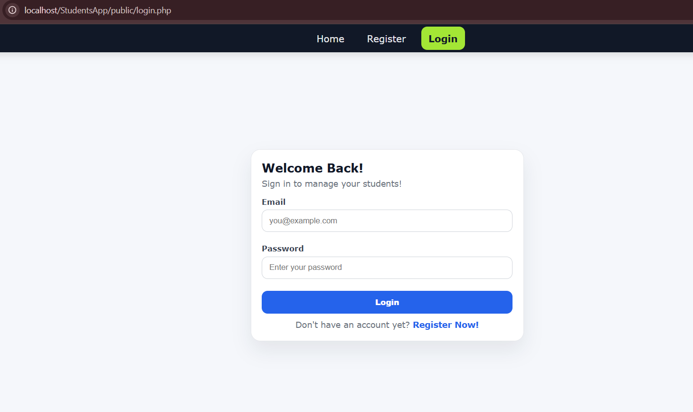
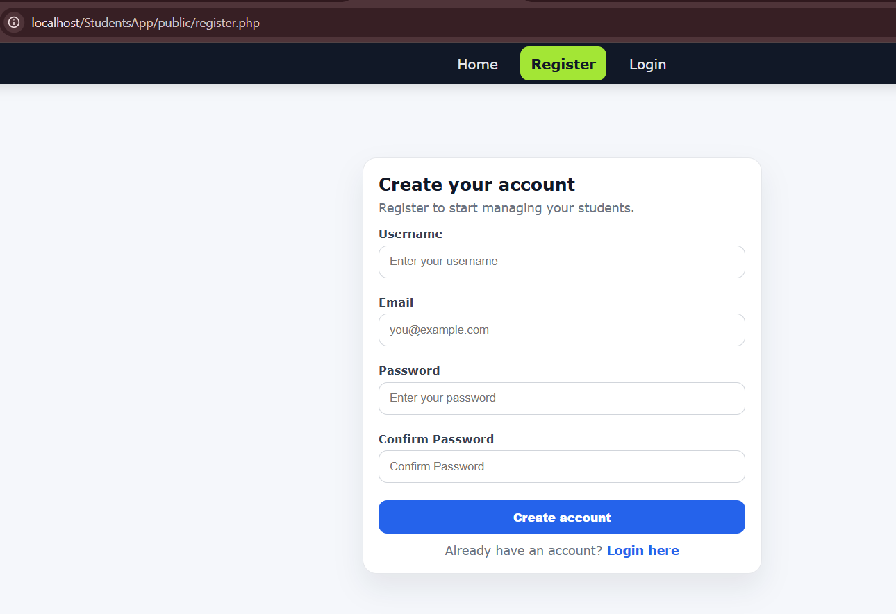
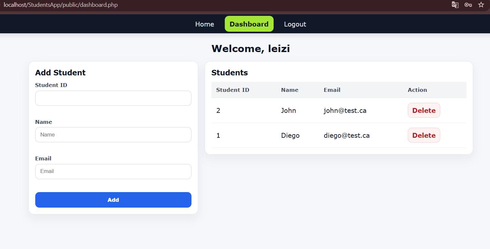

<h1 align="center">
 Student Information Management App</h1>

  A PHP MVC-based web application for managing students with authentication and secure database configuration.

<h2>:floppy_disk: Project Overview</h2>

This project is a Student Information Management system built using pure PHP with an MVC architecture.
It allows authenticated users to manage student records securely.

<ul>
  <li>User registration & login system</li>
  <li>Session-based authentication</li>
  <li>Student CRUD operations</li>
  <li>Environment-based database configuration using <strong>dotenv</strong></li>
  <li>Secure MySQL connection via XAMPP</li>
</ul>

<h2>🔧 Tech Stack</h2>

<ul>
  <li><strong>PHP 8+</strong></li>
  <li><strong>MySQL</strong></li>
  <li><strong>XAMPP</strong></li>
  <li><strong>Composer</strong></li>
  <li><strong>vlucas/phpdotenv</strong></li>
  <li>MVC Architecture</li>
</ul>

<h2 align="center"> Application Preview</h2>

  A preview of the main application interfaces.

 

<table align="center">
  <tr>
    <td align="center">
      <strong>🏠 Home</strong> 
      
    </td>
    <td align="center">
      <strong>🔐 Login</strong> 
      
    </td>
  </tr>
  <tr>
    <td align="center">
      <strong>📝 Register</strong> 
      
    </td>
    <td align="center">
      <strong>📊 Dashboard</strong> 
      
    </td>
  </tr>
</table>

 

<h2 align="center"> Application Demo</h2>
 
 
https://github.com/user-attachments/assets/f9490c15-0f2f-42ef-a54d-c01e664691b4

<h2>:open_file_folder: Project Structure</h2>

<pre>
StudentsApp/
│
├── config/
│   ├── Database.php
│   └── bootstrap.php
│
├── controllers/
├── models/
├── views/
├── helpers/
├── public/
│
├── .env.example
├── composer.json
└── README.md
</pre>

<h2>:gear: Environment Configuration</h2>

This project uses environment variables to securely manage database credentials.

<h3>1️⃣ Create a .env file in the root directory:</h3>

<pre>
DB_HOST=127.0.0.1
DB_PORT=3306
DB_NAME=studentapp
DB_USER=root
DB_PASS=
</pre>

<h3>2️⃣ Install dependencies:</h3>

<pre>
composer install
</pre>

<h2>💡 How to Run Locally</h2>

<ol>
  <li>Clone the repository</li>
  <li>Move the project into your <code>htdocs</code> folder</li>
  <li>Start Apache and MySQL via XAMPP</li>
  <li>Create a database named <strong>studentapp</strong></li>
  <li>Import required tables (users, students)</li>
  <li>Access the application:</li>
</ol>

<pre>
http://localhost/StudentsApp/public/login.php
</pre>

<h2>🔐 Authentication Flow</h2>

<ul>
  <li>Secure password hashing</li>
  <li>Session management</li>
  <li>Protected routes via middleware-like helpers</li>
  <li>Logout via session destruction</li>
</ul>

<h2>📈 Learning Objectives</h2>

<ul>
  <li>Understanding MVC architecture in PHP</li>
  <li>Secure credential management with dotenv</li>
  <li>Database connection handling</li>
  <li>Session-based authentication</li>
  <li>Professional Git & GitHub workflow</li>
</ul>

<h2>
 Author</h2>

<strong>Leiziane Trevisan Dardin</strong> 
Software Development Student 
Bow Valley College – Calgary, Canada

Built with :heart: using PHP & MySQL

